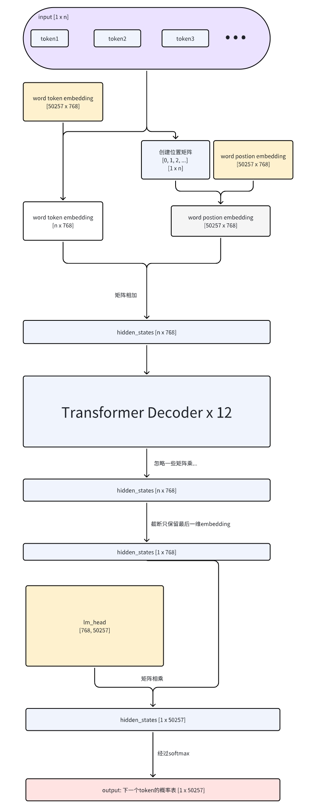

## gpt2推理 gpt2 infer

### 图解gpt2模型
#### 关键词提前看：
- token: 输入序列中的最小语言单位
- token id: 对应于词汇表中的唯一索引
- word token embedding: 将 token 转换为向量表示的映射
- word postion embedding: 为 token 提供位置信息的向量表示
- lm head: 语言模型的输出层，用于预测下一个 token 或生成序列

#### 模型框架

##### 输入

模型推理的输入是`token id数组`。(`token id数组`的由来可以参考扩展。)

`token`代表的文字和位置，对于人类来说是有意义的。但是机器看不懂。所以我们需要把这个`token id`映射到它对应的embedding。`WTE`(word token embedding)矩阵里的每一行embedding，都是对应token的`向量表示`。`WPE`(word postion embedding)是位置信息的`向量表示`。 `WTE`和`WPE`里的参数都是通过训练时得到的。获取这token的embedding和对应位置信息embeddding后，把它们相加起来，就得到了完整的语义。

##### 输出

在上图可以注意到，在经过`transformer Decoder`后，[n x 768]的`hidden_states`只获取了最后一维。`hidden_states`形状变成了[1 x 768]。 这是因为最后一维的`hidden_states`已经包含整个`prompt`的所有信息了。原因后续会详细介绍。[1 x 768]`hidden_states`与`lm_head`矩阵相乘，最终获取下一个token在词表中的分布概率。值得一提的是，这里的`lm_head`和上文中的`WTE`是共享参数的，与llama架构有区别。

#### Transformer Decoder

`Transformer Decoder`里有两大组成部分，`self attention`和`mlp`。mlp里都是一些矩阵相乘和激活函数，这里就先不说了。有兴趣的同学可以自行查阅。这里我们把目光方向`self attention`。

##### 单头注意力

<!-- 待画图 -->
<!-- 待补充 -->

##### 多头注意力

<!-- 待画图 -->
<!-- 待补充 -->

### 扩展

#### 用户输入转成`token id数组`
那么我们如何获取`token id数组`呢？在我们使用LLM应用的时候，我们会输入一些内容给模型，这些内容也称为`prompt`。这时候就需要我们的`tokenizer`把`prompt`转为`token id数组`。在本次示例中，我们直接使用了`GPT2Tokenizer`。

`GPT2Tokenizer`使用的是BPE算法，这里简要介绍下应用的过程

1. 通过正则表达式将`prompt`拆分成一个个`token`
2. `token` 映射成 `token id`
3. 根据BPE训练数据，合并`token id数组`中可以合并的`token id`
4. 输出结果

